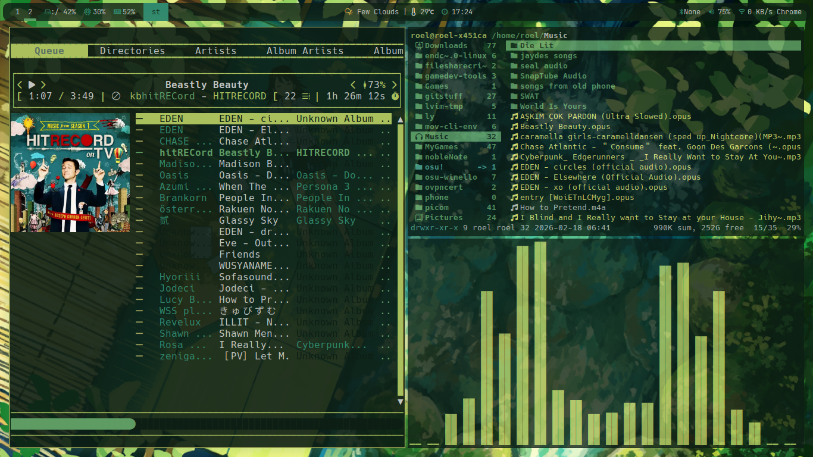
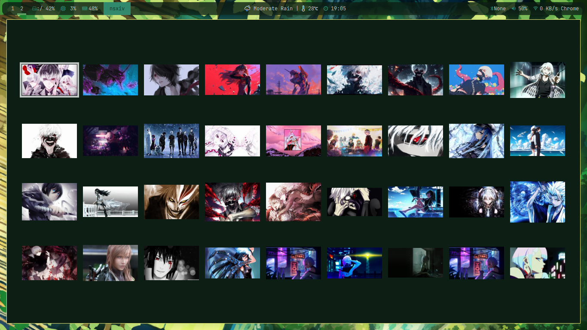
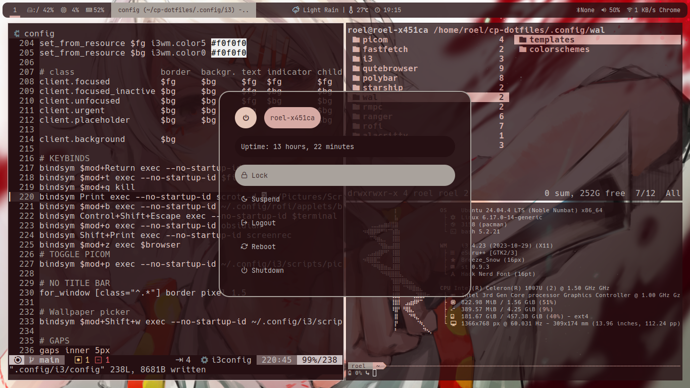
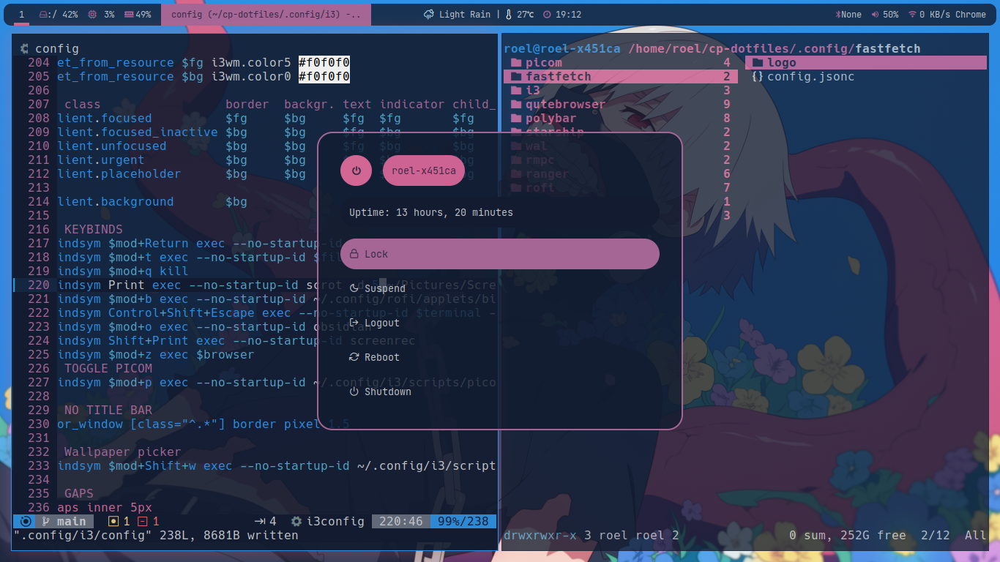
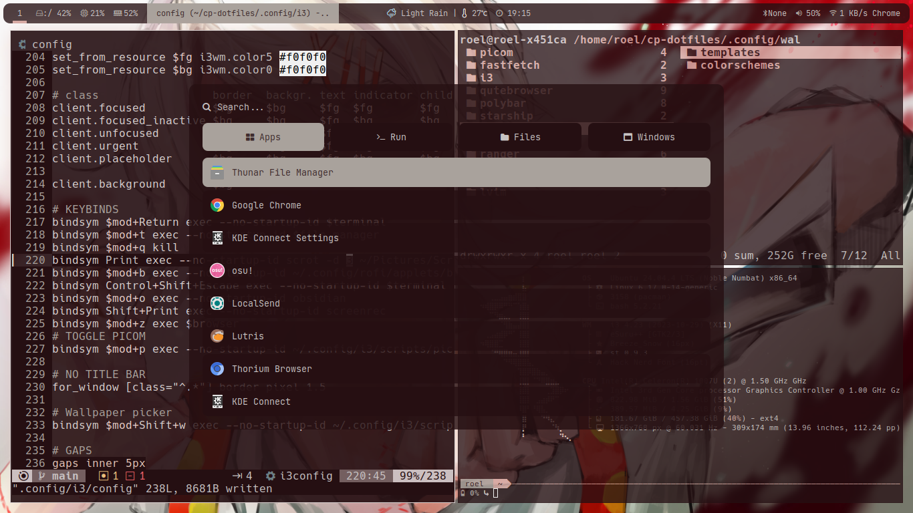

# My Simple I3wm Rice
## Overview
A really clean and simple looking rice, uses pywal16 as its color generator and picom to handle animations and transparency

## Screenshots

## Features
* Lightweight and fast
* Full pywal16 integrations with custom templates
* Custom wallpaper picker script using nxsiv 
* Sleek window animations
* Keyboard centric navigations (refer to 13 config for keybinds)
* Easy to configure

## Pre-requisites
* I3
* Polybar
* Picom yshui fork
* Pywal16
* Polybar
* Rofi
* Dunst

